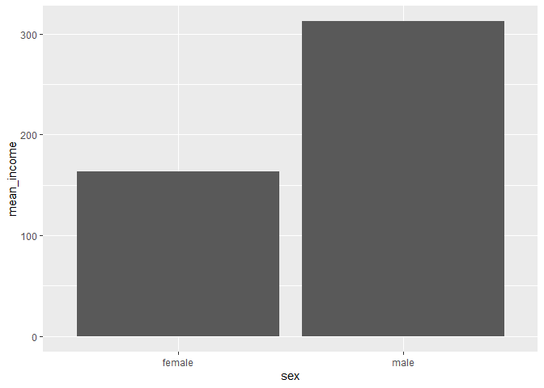

성별에 따른 월급 차이를 알아봅시다.
================
강화정
July 30, 2020

## 2\. 성별에 따른 월급 차이

과거에 비해 여성들이 활발하게 사회 진출을 한다고는 하지만 직장에서 받는 대우에는 여전히 차별이 존재합니다. 데이터 분석을 통해
성별에 따라 월급 차이가 있는지 알아보겠습니다.

### 분석 절차

1단계(변수 검토 및 전처리) - 성별 & 월급

2단계(변수 간 관계 분석) - 성별 월급 평균표 만들기 & 그래프 만들기

### 성별 변수 검토 및 전처리

#### 1\. 변수 검토하기

변수의 타입을 파악하고 각 범주에 몇 명이 있는지 알아봅니다.

``` r
class(welfare$sex)
table(welfare$sex)
```

#### 2\. 전처리

1은 남자, 2는 여자를 의미합니다. 9는 모름/무응답을 의미합니다. 이상치와 모름/무응답은 결측 처리합니다.

``` r
table(welfare$sex)
```

``` r
welfare$sex <- ifelse(welfare$sex == 9, NA, welfare$sex)
table(is.na(welfare$sex))
```

    ## 
    ## FALSE 
    ## 16664

``` r
welfare$sex <- ifelse(welfare$sex == 1, "male", "female")
table(welfare$sex)
```

    ## 
    ## female   male 
    ##   9086   7578

``` r
qplot(welfare$sex)
```

<!-- -->

### 월급 변수 검토 및 전처리

#### 1\. 변수 검토하기

월급은 ’일한 달의 월 평균 임금’을 의미하며 1만 원 단위로 기록되어 있습니다.

``` r
class(welfare$income)
```

``` r
summary(welfare$income)
```

    ##    Min. 1st Qu.  Median    Mean 3rd Qu.    Max.    NA's 
    ##     0.0   122.0   192.5   241.6   316.6  2400.0   12030

``` r
qplot(welfare$income) + xlim(0, 1000)
```

    ## `stat_bin()` using `bins = 30`. Pick better value with `binwidth`.

<!-- -->

#### 2\. 전처리

월급은 1\~9998 사이의 값을 지니며, 모름/무응답은 9999로 코딩되어 있습니다.

``` r
summary(welfare$income)
```

    ##    Min. 1st Qu.  Median    Mean 3rd Qu.    Max.    NA's 
    ##     0.0   122.0   192.5   241.6   316.6  2400.0   12030

``` r
welfare$income <- ifelse(welfare$income %in% c(0, 9999), NA, welfare$income)
table(is.na(welfare$income))
```

    ## 
    ## FALSE  TRUE 
    ##  4620 12044

### 성별에 따른 월급 차이 분석하기

#### 1\. 성별 월급 평균표 만들기

``` r
sex_income <- welfare %>% 
  filter(!is.na(income)) %>% 
  group_by(sex) %>% 
  summarise(mean_income = mean(income))
```

    ## `summarise()` ungrouping output (override with `.groups` argument)

``` r
sex_income
```

    ## # A tibble: 2 x 2
    ##   sex    mean_income
    ##   <chr>        <dbl>
    ## 1 female        163.
    ## 2 male          312.

#### 2\. 그래프 만들기

``` r
ggplot(data = sex_income, aes(x = sex, y = mean_income)) + geom_col()
```

<!-- -->
